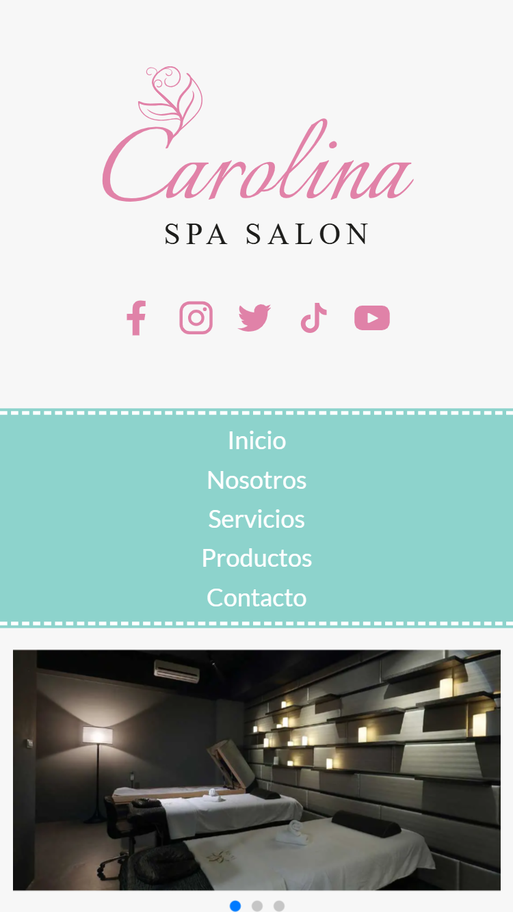
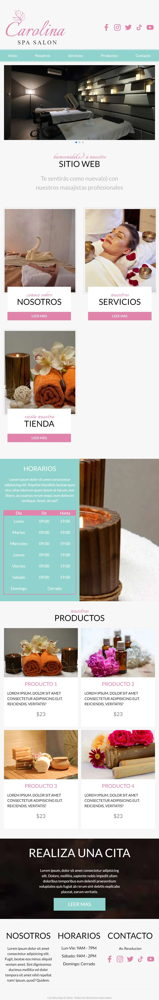
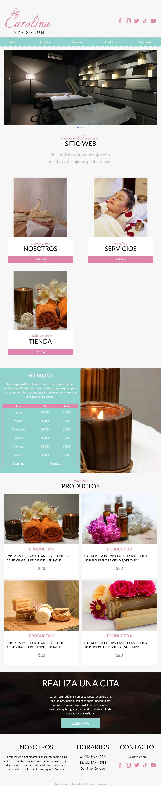
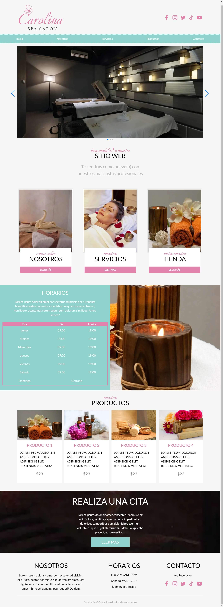

# Landing page usando SASS, GULP y swiper js.

Proyecto realizado con base al curso de Udemy "**CSS La Guía Completa - Flexbox, CSS Grid, SASS +20 proyectos**."

## Descripcion

En esta lading page se uso el preprocesador **SASS** para el manejo de estilos de manera modular, **Gulp** para la automatizacion de tareas tales como compilar SASS, minificar CSS y JS, optimizacion de imagenes, entre otros. Se uso la libreria **Swiper js** para el manejo de los sliders.

El diseño es completamente responsivo, adapatable a diferentes resoluciones utilizando los siguientes breakpoints:

**Breakpoints utilizados**

- Mobile large: **620px**;
- Tablet: **768px**;
- Desktop: **1210px**;
- Desktop amplio: **1500px**;

Por ultimo se optimizaron las imagenes utlizando el formato **webp** para mejorar el rendimiento de la pagina.

## Capturas en diferentes resoluciones.

### Mobile (>375px)

### Tablet (>768px)

### Desktop (>1210px)

### Desktop amplio (>1500px)

## Tecnologias, herramientas y metodologias utilizadas

- HTML5
- CSS3
- SASS
- Gulp
- Swiper js
- BEM
- Mobile first

## Link de la landing page.

Accede [aqui](https://gonzagapa.github.io/Carolina-span-protect-course/)
